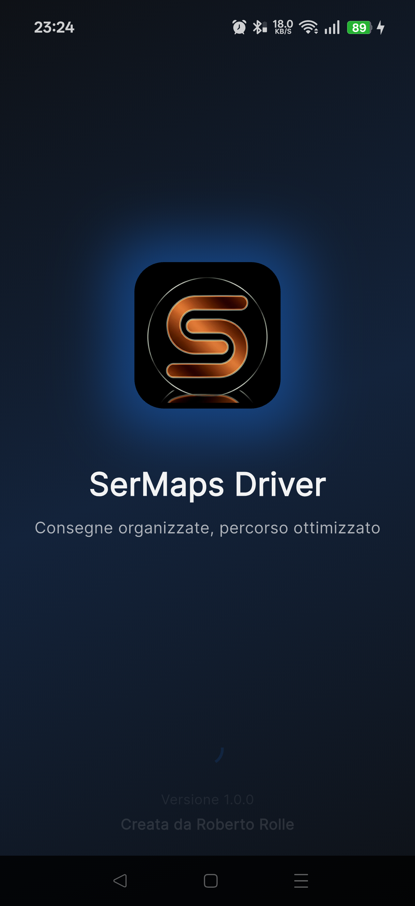
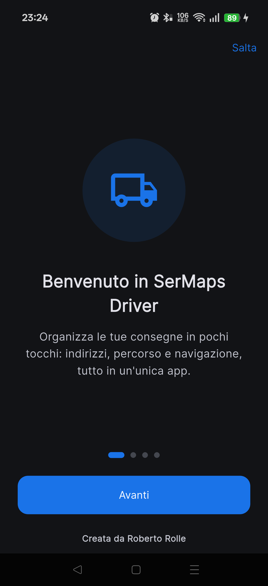
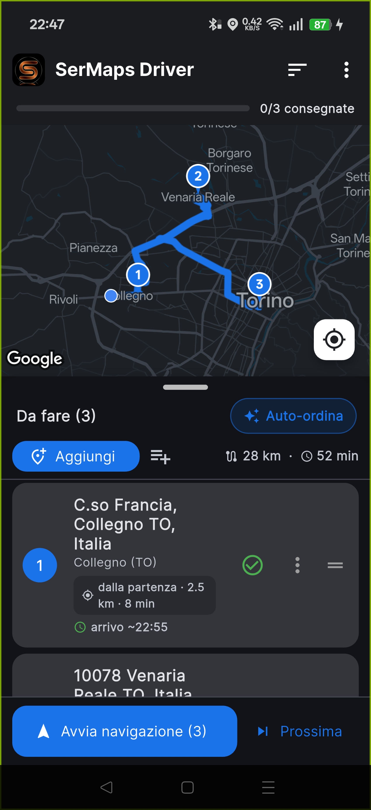
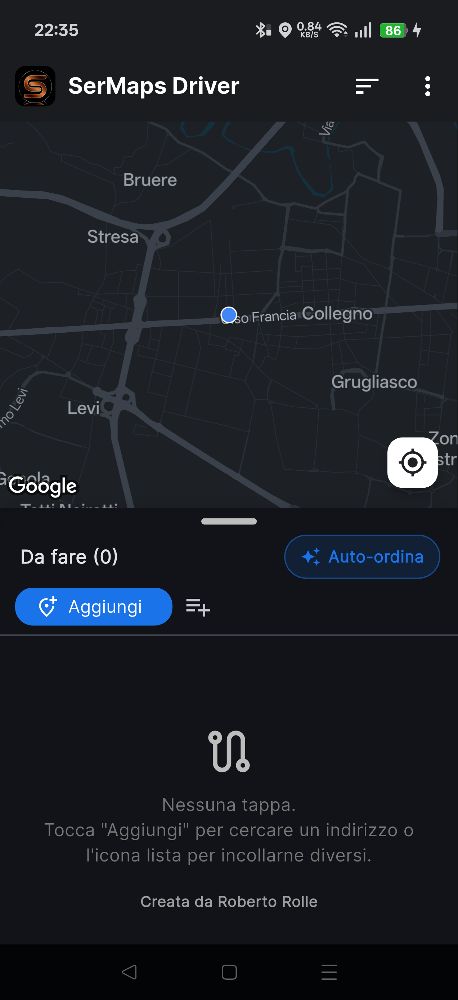
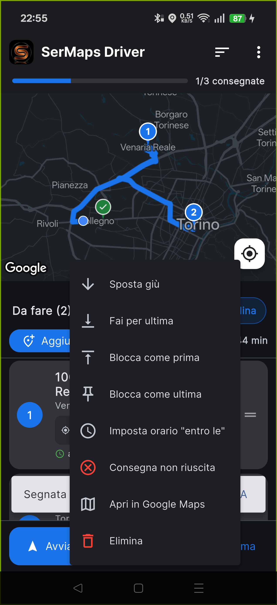
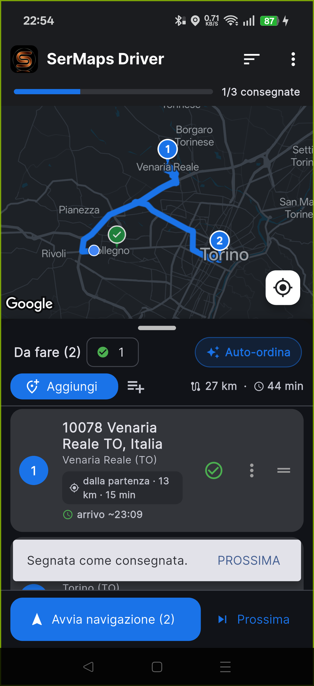
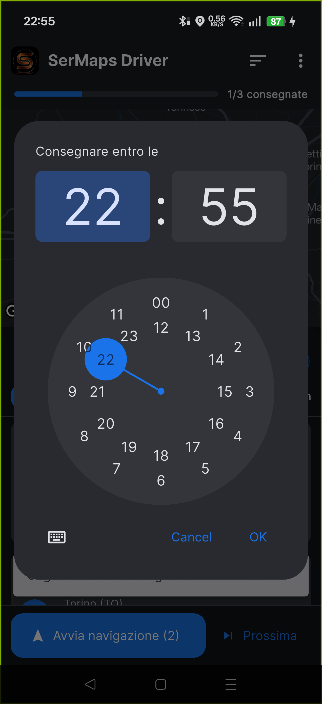
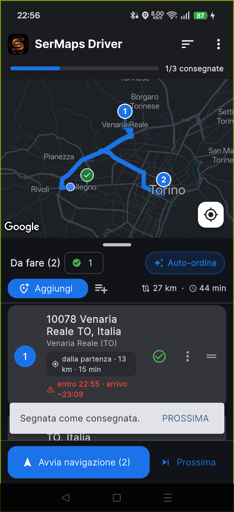
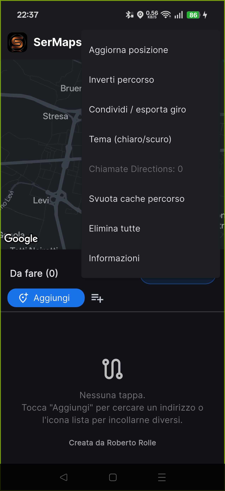
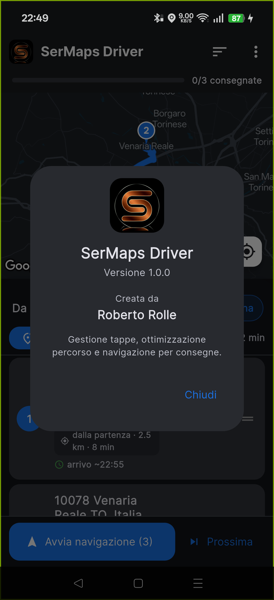

# SerMaps Driver — Manuale d'uso

> **Versione 1.0.0** · _Creata da **Roberto Rolle**_

**SerMaps Driver** è l'app per chi effettua consegne o sopralluoghi con più
tappe: raccoglie gli indirizzi, calcola l'ordine più conveniente, mostra gli
orari di arrivo e avvia la navigazione con Google Maps.

> 📄 Versione stampabile: **[GUIDA.pdf](GUIDA.pdf)**

---

## Indice

1. [Introduzione](#1-introduzione)
2. [Primo avvio](#2-primo-avvio)
3. [La schermata principale](#3-la-schermata-principale)
4. [Aggiungere le tappe](#4-aggiungere-le-tappe)
5. [Ordinare e gestire le tappe](#5-ordinare-e-gestire-le-tappe)
6. [Stato delle consegne](#6-stato-delle-consegne)
7. [Orari di consegna e arrivo stimato](#7-orari-di-consegna-e-arrivo-stimato)
8. [Avviare la navigazione](#8-avviare-la-navigazione)
9. [Tema chiaro/scuro e colore app](#9-tema-chiaroscuro-e-colore-app)
10. [Guida e informazioni nell'app](#10-guida-e-informazioni-nellapp)
11. [Suggerimenti utili](#11-suggerimenti-utili)
12. [Domande frequenti e problemi](#12-domande-frequenti-e-problemi)

---

## 1. Introduzione

Con SerMaps Driver puoi:

- Aggiungere indirizzi singolarmente, **dettandoli a voce** o incollando un'intera lista.
- Indicare per ogni tappa il **tipo di intervento** (LIS, IGT, SISAL, TLC, GBO, GLOBAL), **note** e la **pausa pranzo** del punto.
- Ottimizzare il giro partendo dalla tappa più vicina a te, **evitando di arrivare durante la pausa pranzo**.
- Vedere distanza, tempo totale e **orario di arrivo stimato** per ogni tappa.
- Impostare un **orario limite** ("entro le") con avviso di ritardo.
- Segnare le consegne fatte e proseguire alla tappa successiva.
- Avviare la **navigazione** con un tocco.

> **Requisiti:** smartphone Android con connessione dati e GPS attivo. Alla
> prima apertura concedi il permesso di **posizione**.

---

## 2. Primo avvio

All'apertura compare la schermata di benvenuto animata. Solo la **prima volta**,
una breve introduzione in 4 passaggi spiega come funziona l'app. Usa **Avanti**
o **Salta**; potrai rivederla da **⋮ → Rivedi introduzione**.

| Avvio                        | Introduzione                         |
| ---------------------------- | ------------------------------------ |
|  |  |

---

## 3. La schermata principale

- **Barra di avanzamento** (in alto): tappe consegnate sul totale.
- **Mappa**: percorso in blu e marcatori numerati nell'ordine di visita.
- **Riepilogo**: distanza e tempo totali (es. _28 km · 52 min_).
- **Lista tappe**: indirizzo completo, distanza dalla precedente e arrivo stimato.

> Tocca o trascina la **maniglia** sopra "Da fare" per ingrandire la lista o
> tornare alla mappa grande.

---

## 4. Aggiungere le tappe

**Indirizzo singolo:**

1. Tocca **Aggiungi**.
2. Scrivi l'indirizzo e scegli un suggerimento (se ambiguo, scegli tra i risultati).

**A voce:**

1. Tocca **Aggiungi**, poi l'icona del **microfono**.
2. Pronuncia l'indirizzo: mentre parli vedi l'indicatore **"In ascolto…"** e i
   suggerimenti che compaiono. I numeri civici detti a parole (es. _"centotrentotto"_)
   vengono trascritti in cifre (**138**).

**Più indirizzi insieme:**

1. Tocca **Incolla lista**.
2. Incolla gli indirizzi, **uno per riga**, e conferma.

### Dettagli intervento (tipo, note, pausa pranzo)

Appena scegli un indirizzo, l'app apre il foglio **"Dettagli intervento"** e chiede:

- **Tipo di intervento**: LIS, IGT, SISAL, TLC, GBO, GLOBAL.
- **Note** libere (es. citofonare, referente).
- **Pausa pranzo**: interruttore _Orario continuato_ oppure gli orari di chiusura.
  Puoi premere **Salta**: la tappa resta **"Non definito"** e potrai completarla in
  seguito dal **menu ⋮ → Dettagli / note**. Il tipo e la nota compaiono in alto a
  destra sulla tappa; la pausa è mostrata con un'etichetta colorata.

---

## 5. Ordinare e gestire le tappe

- **Auto-ordina**: riordina partendo dalla tappa più vicina a te. Se hai indicato
  gli **orari dei punti vendita**, ti porta a ogni negozio **quando è aperto**,
  rimandando le tappe a cui arriveresti a saracinesca abbassata (prima
  dell'apertura, in pausa pranzo o dopo la chiusura).
- **Sposta a mano**: trascina con l'icona ☰ (disattiva l'auto-ordina).
- **Menu ⋮**: sposta, blocca come prima/ultima, imposta orario, **dettagli / note**,
  apri in Maps, consegna non riuscita, elimina.
- **Scorri a sinistra** per eliminare.
- Dal menu in alto: **Inverti percorso** e **Condividi / esporta giro**.

---

## 6. Stato delle consegne

1. Tocca la **spunta verde** per segnare una tappa **consegnata**.
2. La tappa esce dalla lista, il pin diventa verde e il percorso si ricalcola.
3. Compare **PROSSIMA** per navigare subito alla tappa successiva.

Dal menu ⋮ puoi segnare una consegna come **non riuscita** (pin rosso). Il
contatore **✓** apre le tappe completate, con possibilità di ripristinarle.

> **Nota:** dentro l'app la lista e il percorso si aggiornano da soli. La
> navigazione in **Google Maps non si riavvia da sola**: per inviarle il nuovo
> ordine tocca di nuovo **Avvia navigazione** o **Prossima**.

---

## 7. Orari di consegna e arrivo stimato

1. Apri il menu **⋮** della tappa.
2. Tocca **Imposta orario "entro le"** e scegli l'ora.

L'app calcola l'**orario di arrivo stimato (ETA)**. Se l'arrivo supera l'orario
limite, la tappa è evidenziata in **rosso con avviso**. Dal menu **Ordina**
scegli **"Orario di consegna"** per mettere prima le scadenze più vicine.

| Selettore orario             | Avviso di ritardo              |
| ---------------------------- | ------------------------------ |
|  |  |

---

## 8. Avviare la navigazione

- **Avvia navigazione**: apre Google Maps e parte la guida lungo il giro
  (a blocchi di 10 tappe se sono di più).
- **Prossima**: naviga subito verso la prossima tappa.

> Flusso consigliato: _Avvia navigazione → consegni → segni consegnata →
> PROSSIMA_, fino a fine giro.

---

## 9. Tema chiaro/scuro e colore app

Da **⋮ → Tema (chiaro/scuro)**: **Sistema**, **Chiaro** o **Scuro** (ideale di
sera). La scelta viene salvata.

Da **⋮ → Colore app** puoi scegliere il **colore accento** (Blu, Verde, Viola,
Arancio, Rosso, Teal): tinge pulsanti, pin numerati e il marcatore della tua
posizione. Anche questa scelta viene salvata.

---

## 10. Guida e informazioni nell'app

Dal menu **⋮** trovi anche **Guida** (questo manuale nell'app), **Rivedi
introduzione** e **Informazioni** (versione e autore).

| Menu opzioni             | Informazioni                             |
| ------------------------ | ---------------------------------------- |
|  |  |

---

## 11. Suggerimenti utili

- Tieni il **GPS attivo**: l'ordinamento parte dalla tua posizione reale.
- Segna le tappe man mano: lista pulita e percorso (nell'app) sempre
  aggiornato. Ricorda di toccare **Prossima** per aggiornare Google Maps.
- Tocca una tappa per **centrarla sulla mappa**.
- Usa **Blocca come prima/ultima** per tappe con vincoli.
- **Condividi giro** per inviare la lista a un collega.
- **Indirizzi in cache**: gli indirizzi già cercati vengono memorizzati, così
  reinserirli è immediato e funziona anche **senza campo** (offline).
- **Annulla (UNDO)**: se elimini tutte le tappe o segni una tappa per errore,
  compare un avviso con **ANNULLA** per ripristinare subito.
- **Più di 10 tappe**: l'app mostra **"Giro 1 di N"** e avvia il primo giro;
  completate quelle, tocca di nuovo **Avvia navigazione**.
- **Fine giro**: quando finisci, vedi un **riepilogo** (completate, non
  riuscite, km e durata) e il pulsante **Nuovo giro**.
- **Testo più grande**: l'app rispetta l'ingrandimento testo impostato nel
  telefono (Impostazioni → Schermo → Dimensione testo).

---

## 12. Domande frequenti e problemi

**La mappa resta grigia.** La chiave Google Maps non è configurata o non è
autorizzata. Verifica che siano attive Maps SDK for Android, Geocoding, Places e
Directions.

**Non trova gli indirizzi.** Controlla la connessione. Se la ricerca dà sempre
errore, la chiave API potrebbe avere una restrizione "App Android": per le
ricerche impostala su "Nessuna" con limitazione per API. Usa indirizzi precisi.

**Le tappe non si ordinano da sole.** Attiva **Auto-ordina** e tieni il **GPS**
acceso. Se hai spostato una tappa a mano, l'auto-ordina si disattiva apposta.

**Google Maps non si aggiorna quando consegno.** È normale: dentro l'app la
lista si aggiorna da sola, ma la navigazione va rilanciata con **Prossima** o
**Avvia navigazione**.

**Ho più di 10 tappe.** Google Maps gestisce max 10 tappe per percorso: l'app
avvia il primo "giro" e indica quante restano; poi ritocca **Avvia navigazione**.

**Arrivo in ritardo (rosso).** L'arrivo stimato supera l'orario limite: sposta la
tappa più in alto o usa l'ordinamento **"Orario di consegna"**.

**L'app chiede la posizione.** Concedi il permesso di **posizione**: serve a
centrare la mappa e calcolare l'ordine delle tappe.

> 💡 Puoi rivedere come funziona da **⋮ → Guida** o **⋮ → Rivedi introduzione**
> nell'app.

---

_App e guida realizzate da **Roberto Rolle** — SerMaps Driver v1.0.0_
